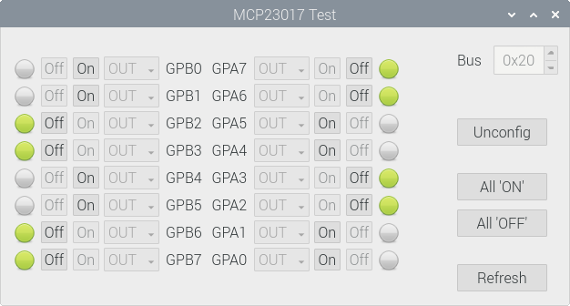

# Features

  Practice to config/control MCP23017 (based on [I2C](https://en.wikipedia.org/wiki/I%C2%B2C)) with Raspberry Pi.

  

# Devices

  - [Raspberry Pi 4 Model B](https://www.raspberrypi.com/products/raspberry-pi-4-model-b/)
  - [Microchip MCP23017](https://www.microchip.com/wwwproducts/en/MCP23017)

# Tools
  - [Qt](https://www.qt.io/) `5.11.3`
  - [WiringPi](https://github.com/WiringPi) `2.50`
